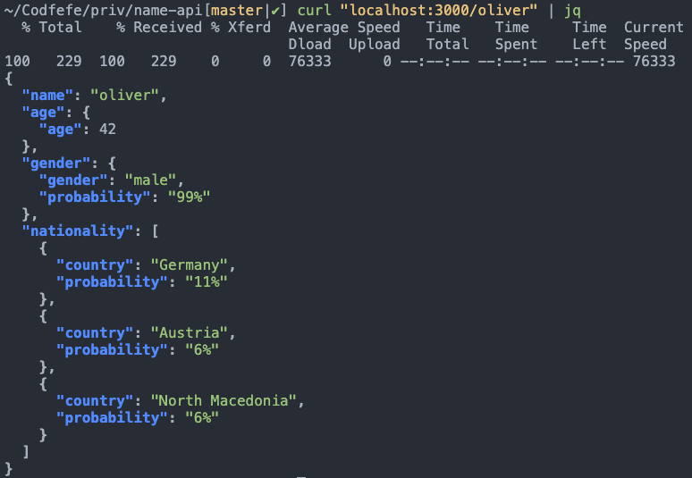
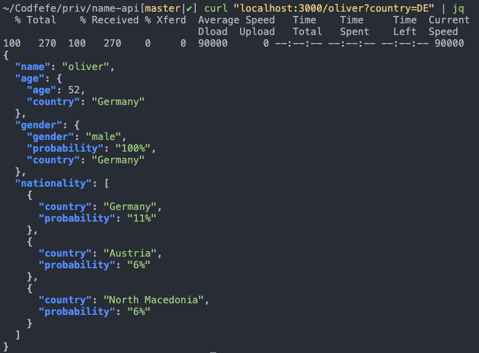

# name-api

REST API wrapper for calling three different APIs to predict/determine a name's [age](https://agify.io/), [gender](https://genderize.io/), and [nationality](https://nationalize.io/) with a single request on the client.

### How to use

Path: `/:name`

Optional query parameter: `country=<country_code>` where `<country_code>` is a country code conforming to [ISO 3166-1 alpha-2](https://en.wikipedia.org/wiki/ISO_3166-1_alpha-2).

